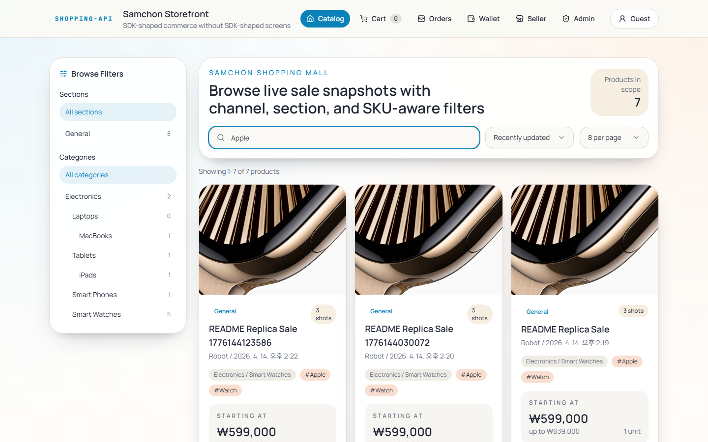
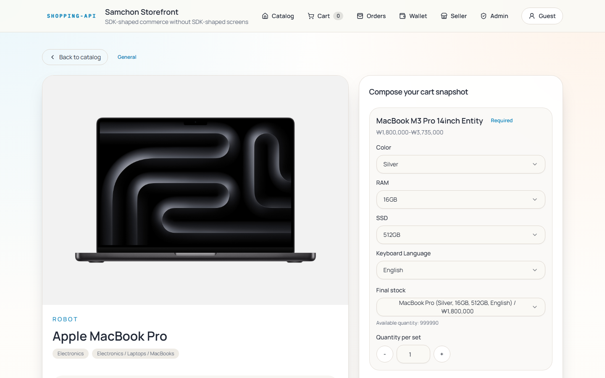
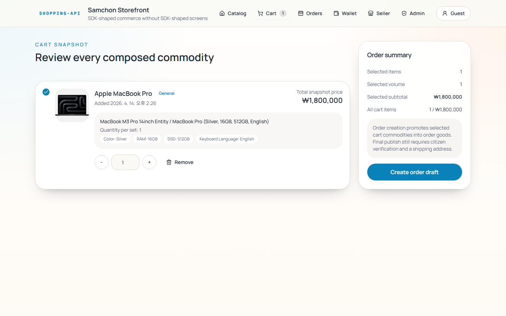
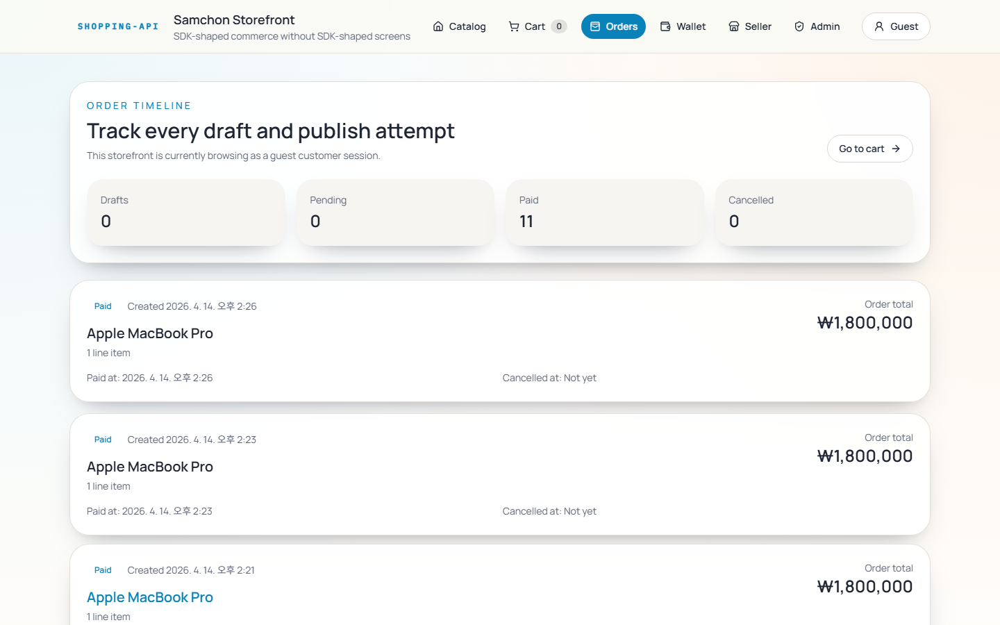
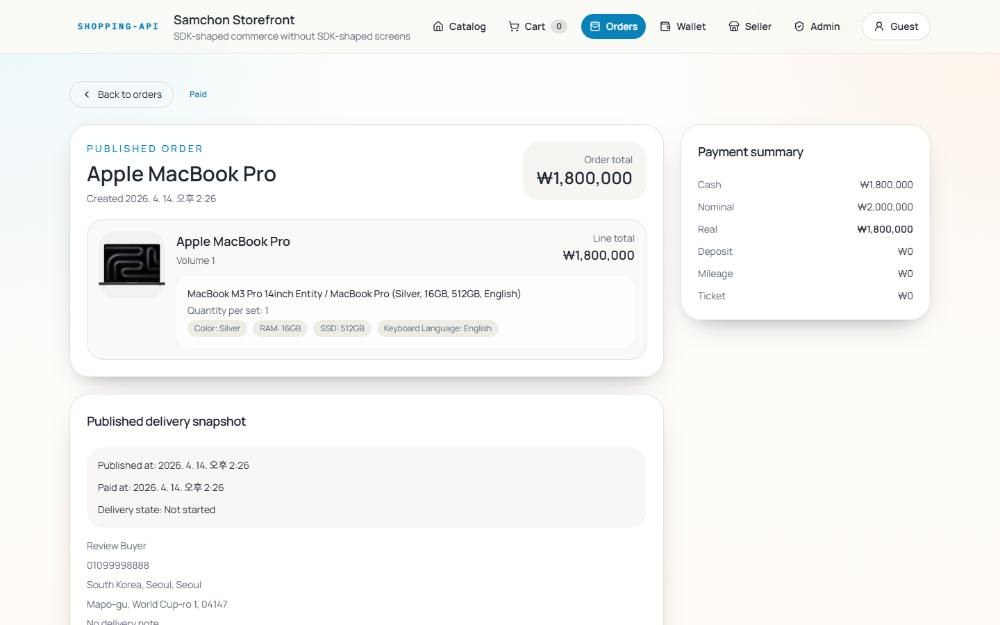
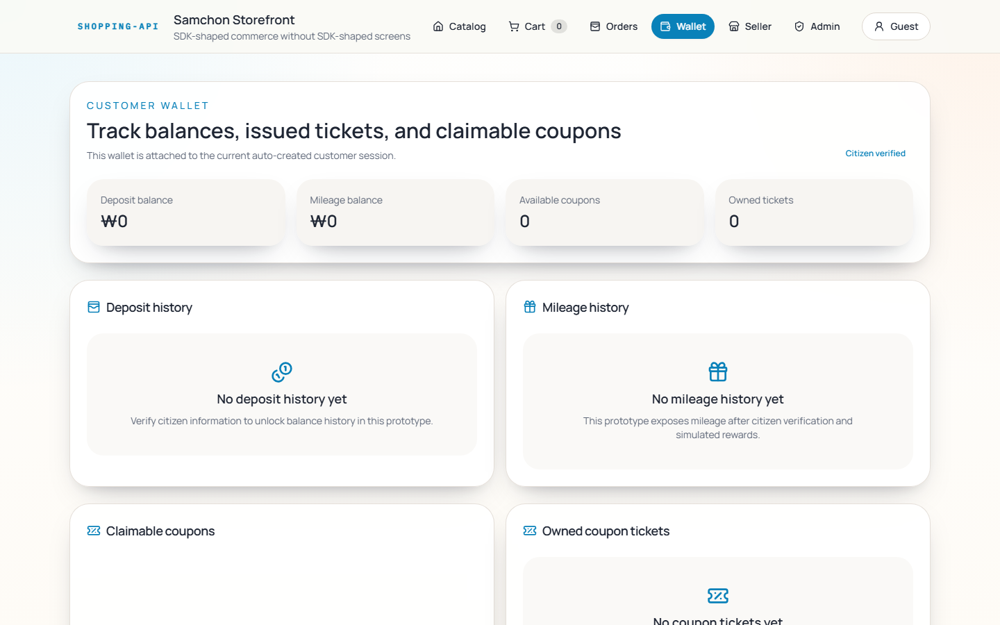
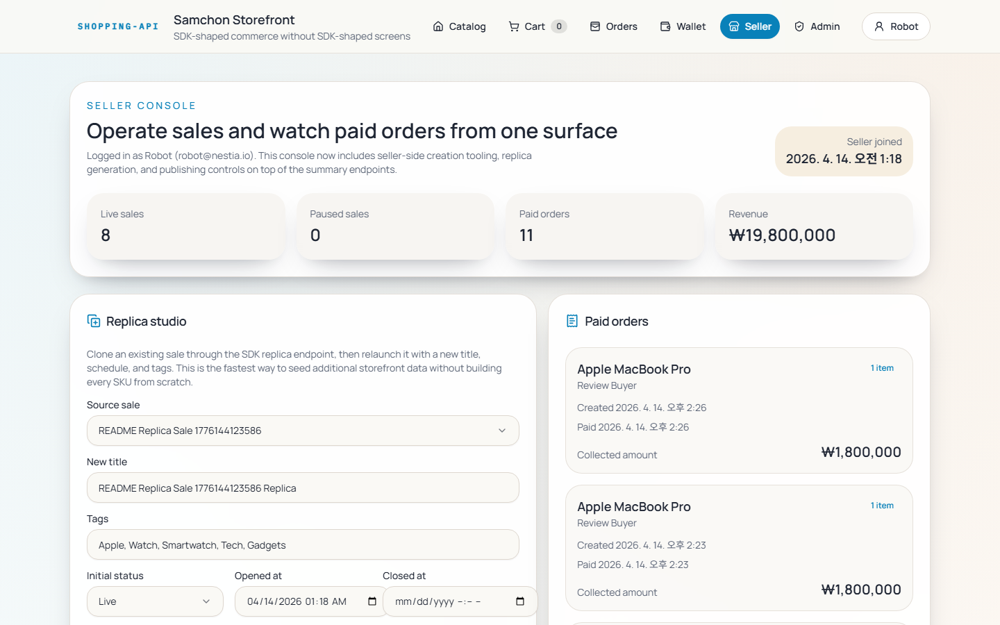
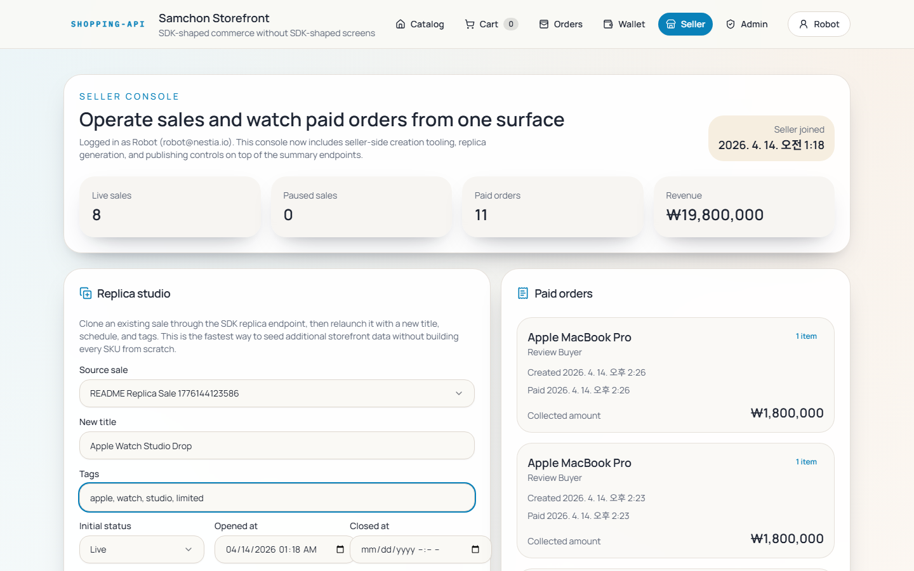
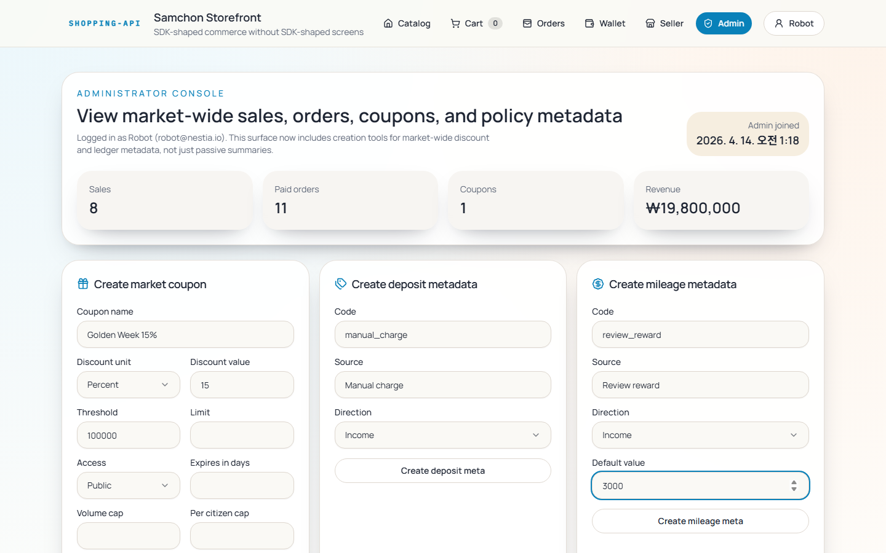

# Frontend of Shopping Mall System
## 1. Outline


[](https://github.com/samchon/shopping-frontend/blob/main/LICENSE)
[](https://www.npmjs.com/package/@samchon/shopping-api)
[](https://github.com/samchon/shopping-frontend/actions/workflows/ci.yml)
[](./wiki/README.md)

This is a Nestia-born frontend project for the sample shopping backend.

The purpose of this repo is simple. If the backend gives you a usable SDK, typed DTOs, and readable comments, frontend automation becomes much more practical. This project was built as a vibe coding storefront with the generated SDK and local [CLAUDE.md](./CLAUDE.md) doing most of the steering, mainly through Codex and Claude Code.

It is not meant to claim that AI will always invent a perfect storefront alone. It is meant to show that backend documentation quality and SDK quality directly change how far frontend automation can go.

Current product coverage:

- Customer storefront with catalog, product detail, cart, order publish, and identity verification
- Customer wallet with deposit, mileage, available coupons, and coupon tickets
- Seller console with seller authentication, sale replica creation, sale schedule controls, and paid-order monitoring
- Administrator console with administrator authentication, coupon creation, and deposit or mileage metadata management

## 2. Getting Started
Start the shopping backend first.

Start the backend in its own workspace first.

```bash
git clone https://github.com/samchon/shopping-backend
cd shopping-backend
docker build -t shopping-backend .
docker run --rm -p 37001:37001 shopping-backend
```

That container boots PostgreSQL, applies the schema, seeds the sample store data, and serves the backend on `http://127.0.0.1:37001`.

If you prefer a manual setup, the backend repository is [`samchon/shopping-backend`](https://github.com/samchon/shopping-backend) and still documents the PostgreSQL and schema-first flow.

Then start the frontend in another terminal and workspace.

```bash
git clone https://github.com/samchon/shopping-frontend
cd shopping-frontend
pnpm install
pnpm dev
```

Default addresses:

- Frontend: `http://127.0.0.1:3000`
- Backend: `http://127.0.0.1:37001`

If the backend host changes, set `NEXT_PUBLIC_SHOPPING_API_HOST` before starting the frontend.

For frontend-only verification, the local Playwright test commands run in deterministic SDK-boundary simulation mode and do not require the backend server.

## 3. Stack
- Next.js App Router
- React
- TypeScript
- Tailwind CSS
- shadcn/ui-style primitives
- React Query
- Playwright
- `@samchon/shopping-api`

## 4. Screens
### Customer


> Home
Catalog landing view with live sale cards, section filters, and search-driven discovery.



> Product Detail
SKU-aware option selectors and a large hero image keep the purchase decision on one screen.



> Cart
The cart turns selected snapshots into a draft order without losing SKU composition details.



> Orders
Draft and published orders stay visible in a single timeline for quick status tracking.



> Order Detail
Identity verification, address input, and publish controls are grouped into one checkout surface.



> Wallet
Deposit, mileage, claimable coupons, and owned tickets are surfaced in one customer wallet dashboard.

### Seller


> Console
The seller dashboard summarizes live sales, paid orders, and revenue with operator-ready metrics.



> Studio
Replica inputs let a seller clone an existing sale into a new launch-ready campaign in minutes.

### Administrator


> Console
The administrator overview gathers market-wide sales, orders, coupons, and revenue into one surface.



> Policies
Coupon, deposit, and mileage policy forms make operator-side commerce metadata editable from the UI.

## 5. Test Automation
This repo uses browser-first testing.

- `pnpm test:e2e`: builds the app in deterministic SDK-boundary simulation mode and runs Playwright against the frontend only
- `pnpm ui:review`: builds the app in deterministic SDK-boundary simulation mode, drives the main screens at desktop, tablet, and mobile sizes, and stores screenshots under `.artifacts/ui-review/`
- `pnpm readme:screens`: refreshes the curated README screenshots under `public/readme/` against the real backend, so start `../shopping-backend` first. This command is guarded to fail if simulation mode is enabled.
- GitHub Actions runs `pnpm check`, `pnpm test:e2e`, and `pnpm ui:review` without booting the backend server

Useful commands:

- `pnpm dev`
- `pnpm check`
- `pnpm build`
- `pnpm start`
- `pnpm test:e2e`
- `pnpm ui:review`
- `pnpm readme:screens`
- `pnpm playwright:install`
